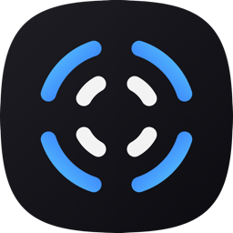
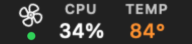
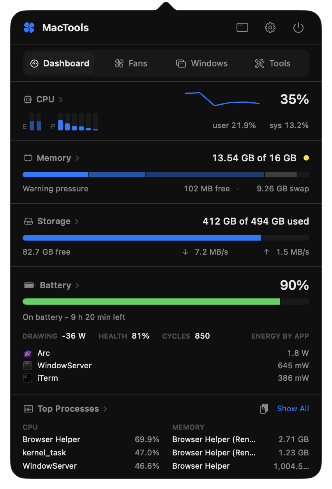
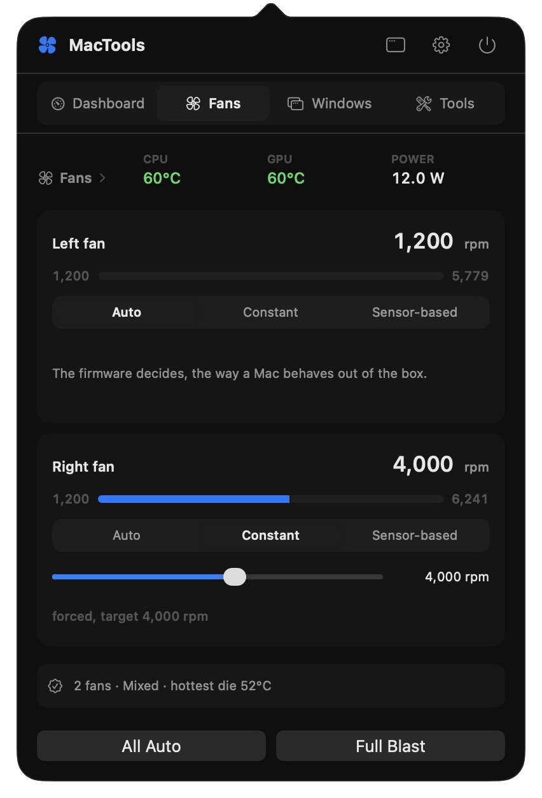
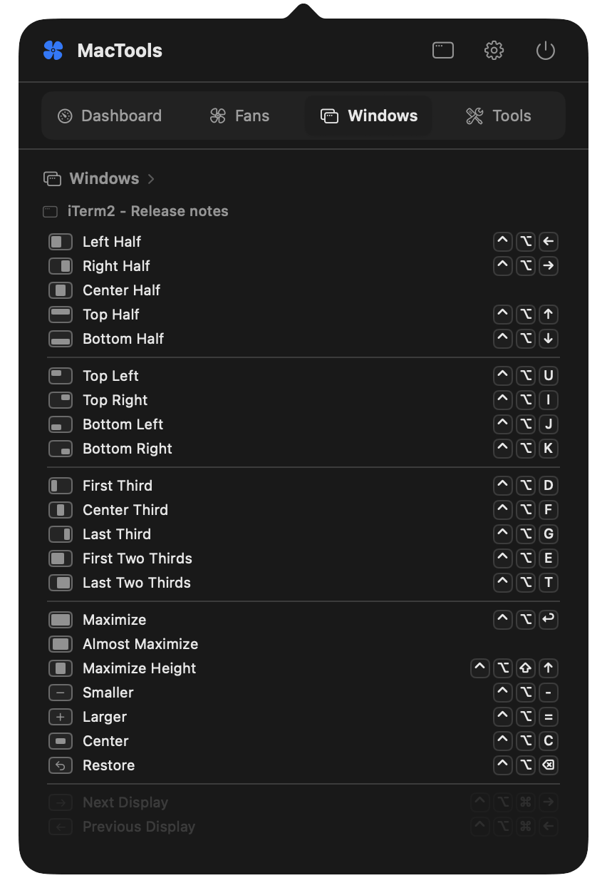

<p align="center">
  
</p>
<h1 align="center">MacTools</h1>

<p align="center">
  <b>One small menu bar app that replaces five.</b><br>
  System monitor, fan control, window snapping, keep awake and keyboard tools for your Mac.
</p>

<p align="center">
  
</p>

<p align="center">
  
  
  
</p>

## What it does

| | |
|---|---|
| **See your Mac at a glance** | CPU per core, memory pressure, storage, battery health, the apps that use the most energy, and the heaviest processes. You choose which numbers live in the menu bar. The temperature turns amber at 70 °C, orange at 80 °C and red at 90 °C. |
| **Control your fans** | Auto, a constant speed, a temperature curve, or Full Blast with one click, right from the menu bar. The fans always go back to Auto when the app quits, crashes or the Mac sleeps. |
| **Snap windows** | Halves, corners, thirds, maximize, center, restore and move between displays. The shortcuts are the same as Rectangle, so your hands already know them. |
| **Keep your Mac awake** | For 30 minutes, some hours, or until you turn it off. Optionally also with the lid closed. A status light shows the truth: green sleeps as usual, amber idle sleep blocked, red lid-close sleep blocked. |
| **Find what fills your disk** | A whole-disk scan lists the largest files with their folder. Move them to the Trash from the list. |
| **Ask an AI what to close** | "Copy for AI" puts your process list or your largest files on the clipboard as a clean table, ready to paste into a chat. |
| **Clean your keyboard** | Lock the keyboard for a minute so you can wipe it without typing nonsense. |
| **Set the keyboard backlight** | A slider, for Macs where the brightness keys are gone. |

## Light on your battery

A monitor must not be the thing that drains your Mac.
Closed, MacTools uses about **0.2 % of one CPU core** and wakes the processor less than once per second.
It samples only what is on screen, slows down on battery and in Low Power Mode, and reads nothing at all when its menu bar item is hidden.

## Install

1. Download the latest `MacTools-<version>.dmg` from [Releases](../../releases).
2. Drag MacTools to Applications and open it.
3. Click the fan icon in the menu bar.

It needs macOS 26 or later on Apple silicon.
The app is signed with a Developer ID and notarized by Apple, so it opens like any other download.
You can also [build it yourself](#build-from-source).

### Permissions

MacTools asks only for what a feature needs, at the moment you use it.

| Permission | Needed for |
|---|---|
| Accessibility | Window snapping and the keyboard lock |
| Privileged helper (your password, one time) | Fan control and "stay awake with the lid closed" |
| Full Disk Access (optional) | A storage scan that also sees Mail, Messages and Photos |

Nothing leaves your Mac.
There is no account, no analytics and no network access.

## Good to know

- **Fan control is your responsibility.** MacTools refuses speeds below the fan's minimum and takes over at 100 °C, but a fan held too low can still make your Mac throttle.
- **A Mac that stays awake with the lid closed gets hot in a bag.** MacTools lets it sleep again when the battery is low or the Mac is hot.
- **Already use Rectangle?** Both apps answer the same shortcuts. Quit one of them, or pick the alternate shortcut set in the Windows tab.

## Build from source

```sh
brew install xcodegen
git clone https://github.com/serenearyal/mactools.git
cd mactools
make install
```

You need Xcode 26.
The architecture, the debug arguments and the test commands are in [docs/DEVELOPMENT.md](docs/DEVELOPMENT.md).

## License

MIT
